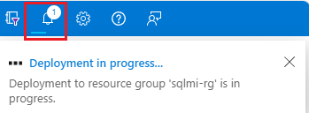

## 1️⃣ Acesso ao Portal do Azure
1. Entre no [Portal do Azure](https://portal.azure.com)
2. No menu esquerdo, selecione **SQL do Azure** ou pesquise em **Todos os serviços**
3. Clique em **+ Criar** e escolha **Instâncias Gerenciadas de SQL → Criar**

---

## 2️⃣ Guia Básico
| Configuração                  | Valor sugerido           | Descrição |
|--------------------------------|------------------------|-----------|
| Assinatura                     | Sua assinatura          | Permissão para criar recursos |
| Grupo de recursos              | Novo ou existente       | Organização dos recursos |
| Nome da instância gerenciada   | Nome válido             | Regras de nomenclatura |
| Região                          | Selecionar região       | Regiões suportadas do Azure |
| Pertence a um pool de instâncias? | Sim ou Não            | Criar dentro de um pool de instâncias |
| Método de autenticação          | SQL                     | Autenticação SQL ou Microsoft Entra |
| Logon do administrador         | Nome válido             | Não usar serveradmin |
| Senha                           | Senha forte             | Mínimo 16 caracteres |

### Computação + Armazenamento
| Configuração           | Valor sugerido         | Descrição |
|------------------------|----------------------|-----------|
| Camada de serviço      | Uso Geral             | Adequada para a maioria das cargas de produção |
| Geração do hardware    | Standard (Gen5)       | Define limites de CPU e memória |
| vCores                 | Número definido       | Recursos de computação provisionados |
| Armazenamento em GB    | Definir conforme necessidade | Tamanho do banco de dados |
| Licença SQL Server     | Selecionar aplicável  | Pagamento conforme uso ou existente |
| Redundância backup     | Geográfica             | Armazenamento de backup seguro |

---

## 3️⃣ Guia Rede
| Configuração                   | Valor sugerido        | Descrição |
|--------------------------------|---------------------|-----------|
| Rede virtual / sub-rede         | Criar ou existente  | Modificar se necessário |
| Tipo de conexão                 | Selecionar adequado | Serviços do Azure, Internet ou Sem acesso |
| Ponto de extremidade público    | Desabilitar          | Permite acesso externo se habilitado |
| Permitir acesso                 | Sem acesso           | Define regras de segurança |

---

## 4️⃣ Guia Segurança
- Mantendo as configurações padrão para início rápido

---

## 5️⃣ Configurações Adicionais
| Configuração                 | Valor sugerido         | Descrição |
|-------------------------------|----------------------|-----------|
| Ordenação                     | Escolher compatível  | Igual à ordenação do SQL Server de origem |
| Fuso horário                   | Definir adequado     | Timezone da instância |
| Replicação geográfica         | Não                  | Somente se usar failover |
| Janela de manutenção           | Definir janela       | Horário para manutenção planejada |

---

## 6️⃣ Marcação
- Adicione tags para identificar **proprietário** e **ambiente** (Produção, Desenvolvimento)

---

## 7️⃣ Revisar + Criar
- Clique em **Examinar + criar** e revise as escolhas
- Clique em **Criar** para implantar a instância

- 

## 8️⃣ Monitoramento
- Use o ícone **Notificações** para verificar o progresso
- Após a conclusão, acesse o **grupo de recursos** para verificar a instância

---

## 9️⃣ Criar Banco de Dados
1. Acesse a instância no portal
2. Clique em **+ Novo banco de dados**
3. Configure nome, fonte de dados (vazio ou backup), e demais parâmetros
4. Clique em **Revisar + criar → Criar**

---

## 10️⃣ Recuperar Detalhes de Conexão
- Na guia **Visão Geral**, copie o **Host / FQDN** para se conectar à instância

