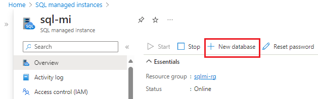

## 1️⃣ Acesso ao Portal do Azure
1. Entre no [Portal do Azure](https://portal.azure.com)
2. No menu esquerdo, selecione **SQL do Azure** ou pesquise em **Todos os serviços**
3. Clique em **+ Criar** e escolha **Instâncias Gerenciadas de SQL → Criar**

---

## 2️⃣ Guia Básico
| Configuração                  | Valor sugerido           | Descrição |
|--------------------------------|------------------------|-----------|
| Assinatura                     | Sua assinatura          | Permissão para criar recursos |
| Grupo de recursos              | Novo ou existente       | Organização dos recursos |
| Nome da instância gerenciada   | Nome válido             | Regras de nomenclatura |
| Região                          | Selecionar região       | Regiões suportadas do Azure |
| Pertence a um pool de instâncias? | Sim ou Não            | Criar dentro de um pool de instâncias |
| Método de autenticação          | SQL                     | Autenticação SQL ou Microsoft Entra |
| Logon do administrador         | Nome válido             | Não usar serveradmin |
| Senha                           | Senha forte             | Mínimo 16 caracteres |

### Computação + Armazenamento
| Configuração           | Valor sugerido         | Descrição |
|------------------------|----------------------|-----------|
| Camada de serviço      | Uso Geral             | Adequada para a maioria das cargas de produção |
| Geração do hardware    | Standard (Gen5)       | Define limites de CPU e memória |
| vCores                 | Número definido       | Recursos de computação provisionados |
| Armazenamento em GB    | Definir conforme necessidade | Tamanho do banco de dados |
| Licença SQL Server     | Selecionar aplicável  | Pagamento conforme uso ou existente |
| Redundância backup     | Geográfica             | Armazenamento de backup seguro |

---

## 3️⃣ Guia Rede
| Configuração                   | Valor sugerido        | Descrição |
|--------------------------------|---------------------|-----------|
| Rede virtual / sub-rede         | Criar ou existente  | Modificar se necessário |
| Tipo de conexão                 | Selecionar adequado | Serviços do Azure, Internet ou Sem acesso |
| Ponto de extremidade público    | Desabilitar          | Permite acesso externo se habilitado |
| Permitir acesso                 | Sem acesso           | Define regras de segurança |

---

## 4️⃣ Guia Segurança
- Mantendo as configurações padrão para início rápido

---

## 5️⃣ Configurações Adicionais
| Configuração                 | Valor sugerido         | Descrição |
|-------------------------------|----------------------|-----------|
| Ordenação                     | Escolher compatível  | Igual à ordenação do SQL Server de origem |
| Fuso horário                   | Definir adequado     | Timezone da instância |
| Replicação geográfica         | Não                  | Somente se usar failover |
| Janela de manutenção           | Definir janela       | Horário para manutenção planejada |

## Revisar Configurações de Rede

1. Selecione o recurso **Tabela de rotas** em seu grupo de recursos para examinar o objeto padrão de tabela de rotas definido pelo usuário e as entradas para rotear o tráfego de e dentro da rede virtual da Instância Gerenciada de SQL.  
   - Para alterar ou adicionar rotas, abra **Rotas** nas configurações da tabela de rotas.

2. Selecione o objeto do **Grupo de Segurança de Rede** para examinar as regras de segurança de entrada e saída.  
   - Para alterar ou adicionar regras, abra **Regras de Segurança de Entrada** e **Regras de Segurança de Saída** nas configurações do grupo de segurança de rede.

**Importante:**  
Se você habilitou o ponto de extremidade público, abra as portas necessárias para permitir conexões da Internet pública com a Instância Gerenciada de SQL.

---

## Criar Banco de Dados

Você pode criar um novo banco de dados usando o **Portal do Azure**, **PowerShell** ou **CLI do Azure**.

### Portal do Azure

1. Acesse a **Instância Gerenciada de SQL** no portal do Azure.
2. Na página **Visão Geral**, clique em **+ Novo banco de dados**.
   
   

3. Dê um nome para o banco de dados na guia **Básico**.
4. Na guia **Fonte de dados**, selecione:
   - **Nenhuma** para um banco de dados vazio, ou
   - Restaure de um **backup** existente.
5. Defina as configurações restantes nas outras guias.
6. Clique em **Revisar + criar** para validar.
7. Clique em **Criar** para implantar o banco de dados.

---

## Recuperar Detalhes da Conexão

Para se conectar à Instância Gerenciada de SQL:

1. Volte ao grupo de recursos e escolha a instância criada.
2. Na guia **Visão Geral**, localize a propriedade **Host**.
3. Copie o nome do host para uso na conexão.

